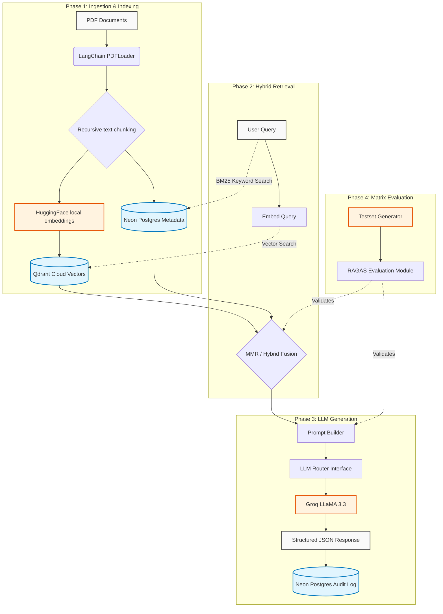

<div align="center">
  <h1>🌊 OceanRAG</h1>
  <p><strong>A Deep-Sea Governance Research Assistant, built from scratch.</strong></p>
  <p><em>Ever wondered how AI can read 7,000 pages of dense legal text and give you the exact answer you need in 0.5 seconds? I built a complete RAG system to find out.</em></p>

  <p>
    
    
    
    
  </p>
</div>

<br/>

<div align="center">
  <a href="#-the-story">The Story</a> • 
  <a href="#-how-it-works">How It Works</a> • 
  <a href="#-features">Features</a> • 
  <a href="#-quick-start">Quick Start</a> • 
  <a href="#-what-i-learned">What I Learned</a> • 
  <a href="#-architecture">Architecture</a>
</div>

---

## 📖 The Story

Retrieval-Augmented Generation (RAG) is the backbone of modern enterprise AI. It's the magic trick that stops LLMs from hallucinating by grounding them in real documents.

But it's not magic. It's math, vector geometry, and data engineering.

I wanted to deeply understand how a complex RAG pipeline actually works. Not by just chaining a few high-level API calls together in a 10-line script — but by building the entire end-to-end system myself. 

**OceanRAG** is the result — an intelligent research assistant designed specifically for deep-sea mining regulations and UNCLOS (United Nations Convention on the Law of the Sea) governance. It:

- 📄 **Ingests** 100+ dense PDF research papers (over 7,000 pages)
- 🔪 **Chunks** them intelligently into 37,000+ searchable pieces
- 🧠 **Embeds** text into 384-dimensional mathematical vectors
- 🗂️ **Indexes** everything into a highly scalable vector database (Qdrant)
- ⚖️ **Retrieves** the perfect context using Hybrid Search (Vector + BM25 keyword matching)
- 🤖 **Generates** grounded, accurate answers using state-of-the-art open weights LLMs (Llama 3, Qwen, Mistral)
- 📊 **Evaluates** itself using automated NLP and RAGAS framework metrics to find the statistically best configuration

Every part of the pipeline — from the initial PDF parsing to the final evaluation matrix — was built to be fast, modular, and observable.

---

## 🧠 How It Works

Let's walk through what happens when you ask OceanRAG: *"What are the environmental obligations under UNCLOS?"*

### Step 1: You Ask → The Query is Embedded
The moment you hit enter, your text query is passed through a local HuggingFace embedding model (`all-MiniLM-L6-v2`). The model converts your English words into a 384-dimensional array of numbers that capture the complex semantic meaning of your question.

### Step 2: Finding Relevant Context → Vector Search
Your 384-dimensional "question vector" is sent to Qdrant Cloud. Qdrant compares it against the 37,013 "document vectors" stored in the database. 

It uses **Cosine Similarity** to find the vectors pointing in the exact same mathematical direction as your question. But pure vector search isn't always enough — sometimes you need exact keyword matches. So OceanRAG uses **Hybrid Search**:
- **Dense Retrieval (Vectors)**: Understands the *meaning* (e.g., matching "environmental obligations" with "ecological duties").
- **Sparse Retrieval (BM25)**: Ensures exact acronyms and specific legal terms like "UNCLOS Article 145" are caught perfectly.

The scores are fused together, returning the top 5 most relevant chunks in just `~0.5 seconds`.

### Step 3: Giving the LLM a Brain → Generation
Those top 5 chunks (along with their original PDF filenames and page numbers) are injected into a highly specific system prompt. 

This massive prompt is sent to a high-speed inference engine (like Groq running Llama 3.3 70B). The instruction is simple: *"You are an expert. Answer the question using ONLY the provided text. Cite your sources."*

### Step 4: Tracking Everything → Observability
The answer comes back in milliseconds. But OceanRAG doesn't stop there. 
1. It shows you the answer with exact citations (e.g. `[Publications-30.pdf, Page 75]`).
2. It logs the exact question, the retrieved chunks, the latency, the cost (down to fractions of a cent), and the LLM's response into a **Neon PostgreSQL Database**. 

You now have a permanent audit trail of exactly how the AI arrived at its conclusion.

---

## ✨ Features

### 📄 Document Processing Engine
- PDF parsing with built-in timeout protection for massive files
- Deterministic chunking (fixes identical chunk ID issues over subsequent runs)
- Full relational metadata tracking (which chunk belongs to which page of which document)

### 🔍 Advanced Retrieval Techniques
- **Pure Vector Similarity:** Blazing fast semantic matching.
- **MMR (Max Marginal Relevance):** Fetches results that are highly relevant to your query, but *different* from each other, maximizing the diversity of the context window.
- **Hybrid Search:** Fuses dense vector scores with BM25 sparse keyword scores for ultimate accuracy on technical domains.

### 🤖 Multi-LLM Generation & Router
Easily swap the "brain" of the system. OceanRAG comes preconfigured to seamlessly route between:
- **Groq API**: `llama-3.3-70b-versatile`, `llama-3.1-8b-instant`, `qwen3-32b`, `llama-4-scout-17b` — ultra-fast inference context generation.
- **HuggingFace API**: `Mistral-Nemo`, `Phi-3.5-mini` — Free inference alternatives.

### 📈 Evaluation Matrix (Phase 4)
How do you know if your RAG is actually good? OceanRAG evaluates *itself*.
The Evaluation Module automatically tests every combination of chunking strategy, embedding model, retriever, and LLM against a synthetic test set, outputting a composite score of:
- **Retrieval Metrics**: Precision@K, Recall@K, Mean Reciprocal Rank (MRR), Hit Rate
- **RAGAS Metrics**: Faithfulness, Answer Relevancy, Context Precision, Context Recall
- **NLP Metrics**: ROUGE-L, BLEU, BERTScore

---

## 🚀 Quick Start

### What You Need
- **Python 3.13**
- A free [Groq API Key](https://console.groq.com/keys) (for the LLM)
- A free [Qdrant Cloud API Key](https://cloud.qdrant.io/) (for the Vector DB)
- A free [Neon PostgreSQL connection string](https://neon.tech/) (for the relational DB)

### 3 Steps to Run

**1. Clone the repo and setup virtual environment**
```bash
git clone https://github.com/sujalkamble007/OceanRAG.git
cd OceanRAG
python -m venv .venv
source .venv/bin/activate
pip install -r requirements.txt
```

**2. Set up your `.env` file**
```env
# Vector Database
QDRANT_URL=https://your-cluster.cloud.qdrant.io
QDRANT_API_KEY=your_qdrant_key
QDRANT_COLLECTION_NAME=OceanRag

# Relational Database
POSTGRES_HOST=ep-your-db.url.neon.tech
POSTGRES_PORT=5432
POSTGRES_DB=neondb
POSTGRES_USER=your_user
POSTGRES_PASSWORD=your_password

# LLMs
GROQ_API_KEY=your_groq_key
# Optional: HF_API_TOKEN=your_hf_token
```

**3. Run the interactive RAG pipeline**
Assuming you have PDFs in `docs/Publications/`, run the ingestion and interact with it:
```bash
# Ingest docs into the DB (only need to do this once)
python main.py

# Ask questions in the interactive terminal
python run_generation.py
```

---

## 🎓 What I Learned

Building a RAG system from scratch taught me more than tweaking parameters in a UI ever could. Here are the biggest takeaways:

### 1. Vector Search isn't enough.
Vector similarity is amazing for *concepts*. But if a user searches for an exact alphanumeric permit ID (`"Permit ISA-449-B"`), pure cosine similarity will struggle. Semantic embeddings map meaning, not exact characters. Implementing **Hybrid Search** (combining vectors with old-school BM25 keyword matching) was a masterclass in how modern enterprise search actually functions.

### 2. Context Window Poisoning is real.
If you just grab the top 10 most similar chunks, they are often perfectly valid, but highly redundant — basically the same sentence written 10 different ways across 10 pages. You waste your context window on zero new information. Implementing **Max Marginal Relevance (MMR)** forced me to mathematically penalize redundancy, giving the LLM a much broader, richer summary of the topic.

### 3. "Good" RAG is hard to measure.
"Vibes" aren't a metric. How do you objectively prove that your `Fixed 512 + 10% overlap` chunking strategy is better than `Fixed 1024`? The answer is building a sprawling evaluation matrix. Using automated judges (like RAGAS) to score Faithfulness and Context Precision taught me that building the pipeline is only 20% of the work; proving it works mathematically is the other 80%.

### 4. Rate limits dictate architecture.
When trying to generate an evaluation testset using a free-tier API, the process crashed immediately because it tried to process 7,000 pages in parallel. Understanding APIs forced me to implement smart document sampling, exponential backoff retries, and asynchronous batching mechanisms to survive strict rate limit envelopes.

---

## 🏗️ Architecture



---

<div align="center">
  <p><em>"The best way to understand something is to build it."</em></p>
  <p>Built with care by <strong>Sujal Kamble</strong></p>
  <p>OceanRAG — find exactly what matters in the deepest of oceans.</p>
</div>
